# Lenovo V330-14IKB For MacOS 11.0.1 BigSur
# OpenCore 0.6.3
***This EFI can be used for previous version of macOS ***
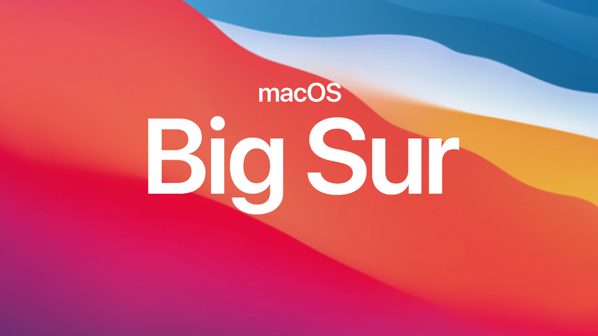
# Specification
- **MainBoard:** Lenovo V330-14IKB.
- **Processor:** Intel Core i5-8250U (KabyLake-R)
- **Graphic:** 
  + Intel UHD620 (1536MB of dynamic memory)
- **Network:**
  + LAN: Realtek RTL811
  + Wifi: Broadcom BCM43525
  + Bluetooth: broadcom DW1560 4.0
- **Audio:** Conexant CX20751
- **Touchpad:** ELAN
- **Storage**:
  + M.2 NVME 256GB
  + SSD Samsung 500GB
- **Keyboard**: Chiclet keyboard 
- **Card Reader**: microSD CardReader
- **Webcam**: VGA Web Camera

# WORKING:
- [x] **Graphics UHD 620**
- [x] **Sound**
- [x] **Ethernet**
- [x] **WiFi**
- [x] **Bluetooth**
- [x] External USB headphone
- [x] USB 2.0
- [x] USB 3.0
- [x] Adjust brightness
- [x] **Fn feature** 
    + **Fn + F1**: Mute
    + **Fn + F2/F3**: Increase/Decrease volume
    + **Fn + F4/F5**: Increase/Decrease screen brightness
    + **Fn + F6**: On/Off Touchpad
    + **Fn + F7/F8**: Increase/Decrease Keyboard Backlight (16 levels)
    + **Fn + F9/F10/F11/F12**: Home/End/PgUp/PgDown
    + **Fn + Space**: Play/Pause
    + **Fn + Enter** : Put Computer to Sleep
    + **Fn + Esc**: On/Off Screen
- [x] Led light keyboard (Fn + F7/F8: Increase/Decrease Keyboard Backlight (16 levels))
- [x] Sleep power
- [x] Battery with Battery Threshold feature
- [x] Trackpad (Only working in Polling MODE with VoodooI2C)
- [x] System Fan Control
- [x] Hardware Acceleration
- [x] Power Management and P-States

# SCREENSHOT
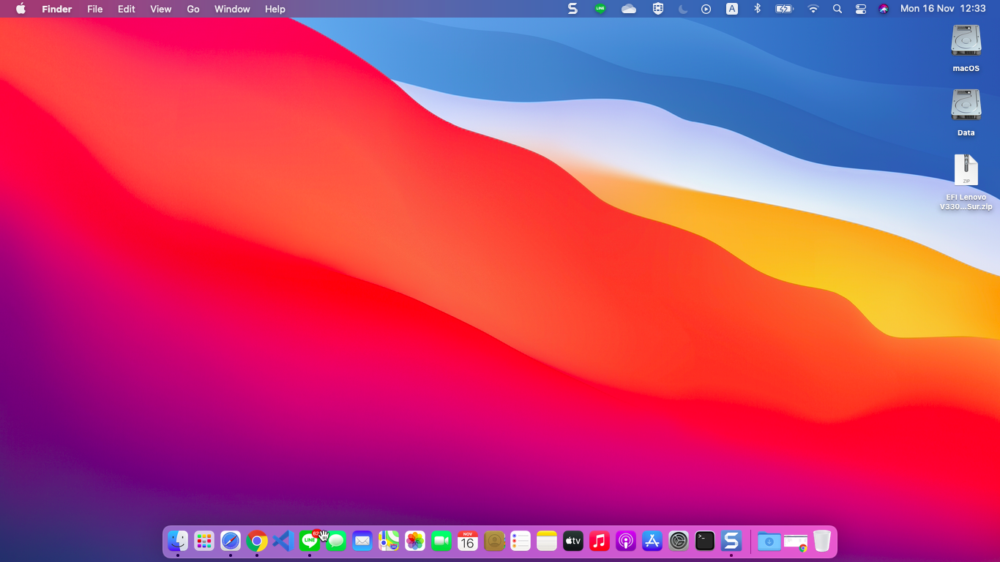
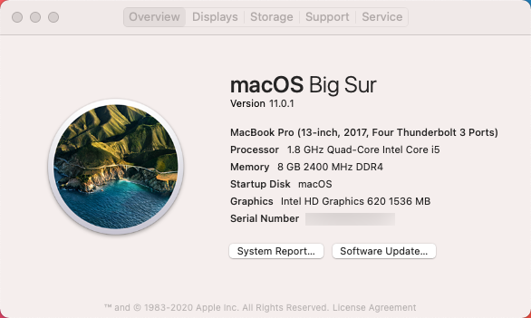
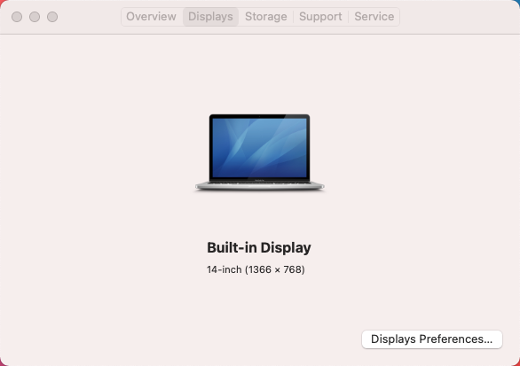
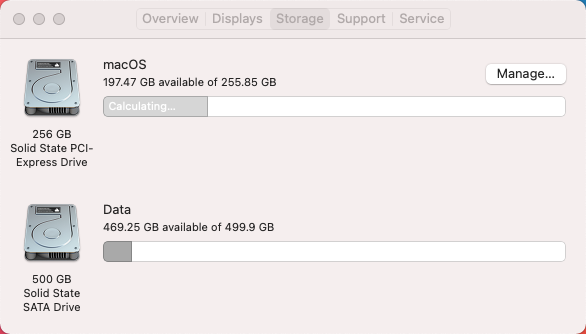
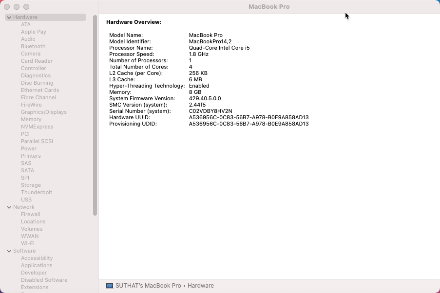
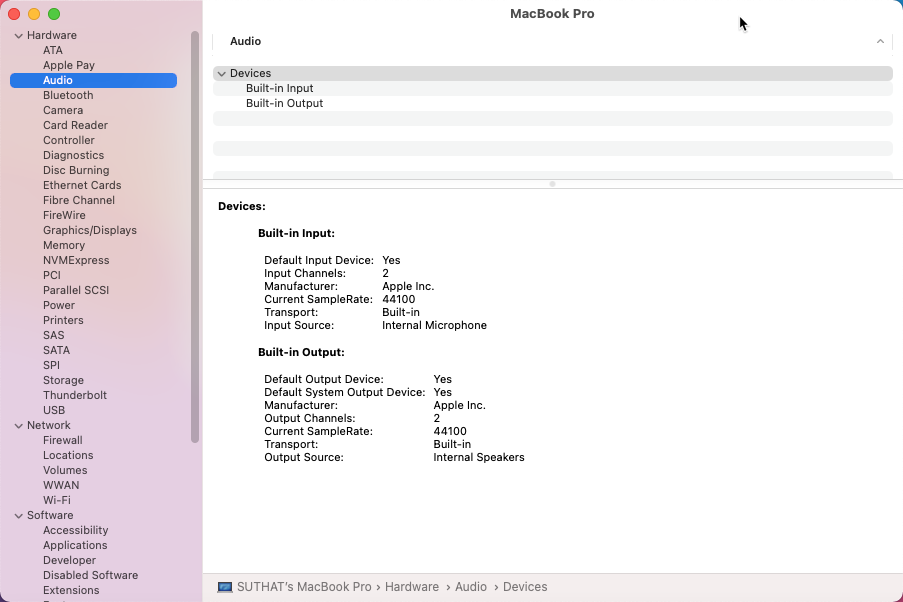
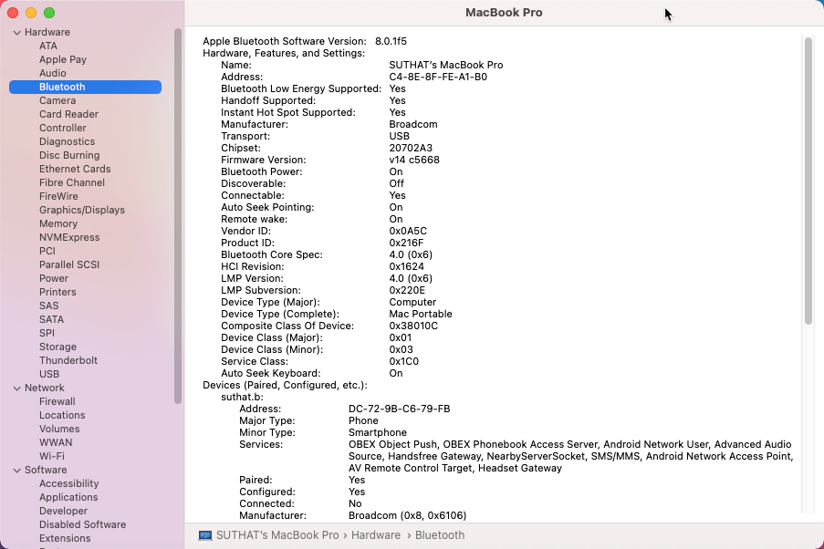
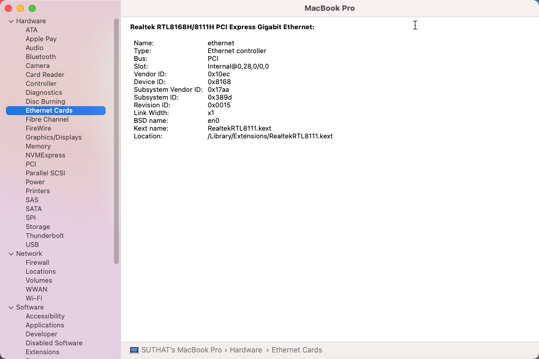
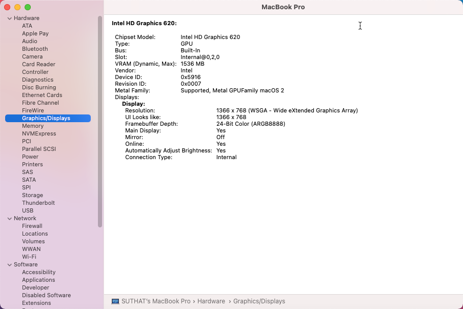
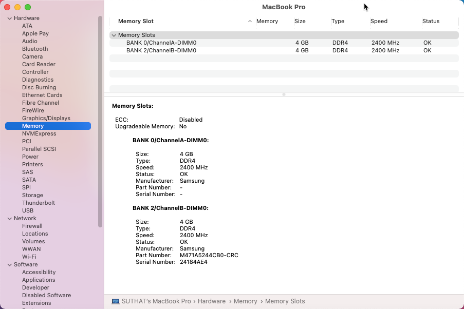
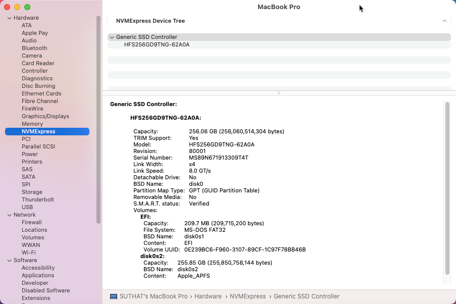
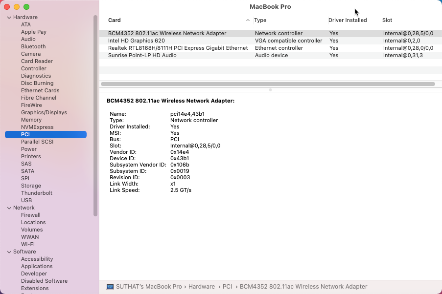
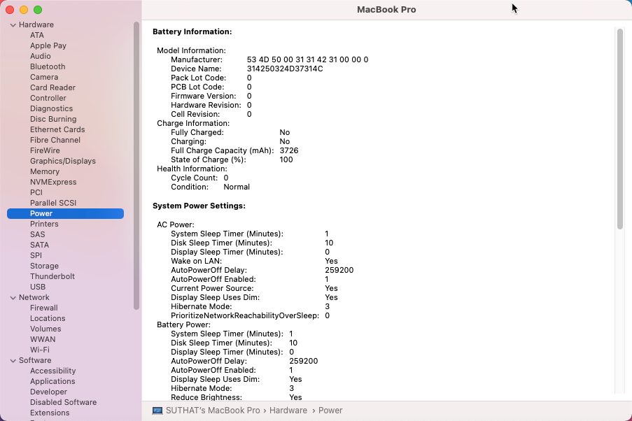
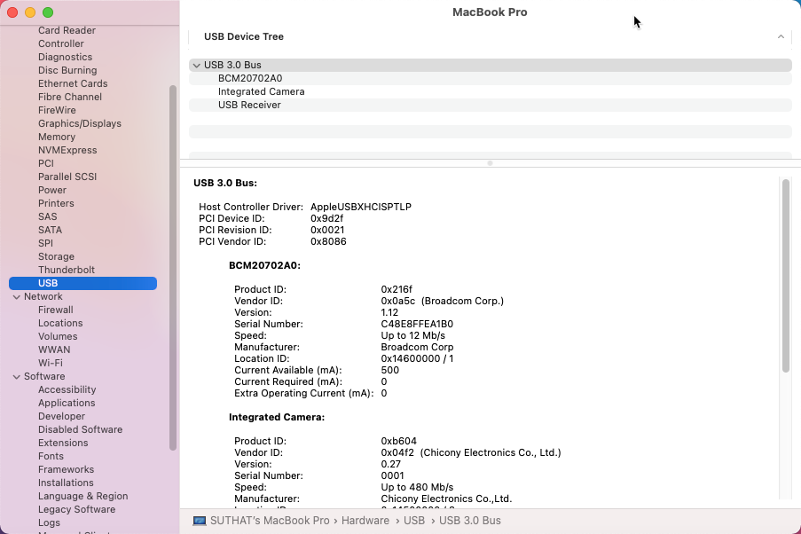